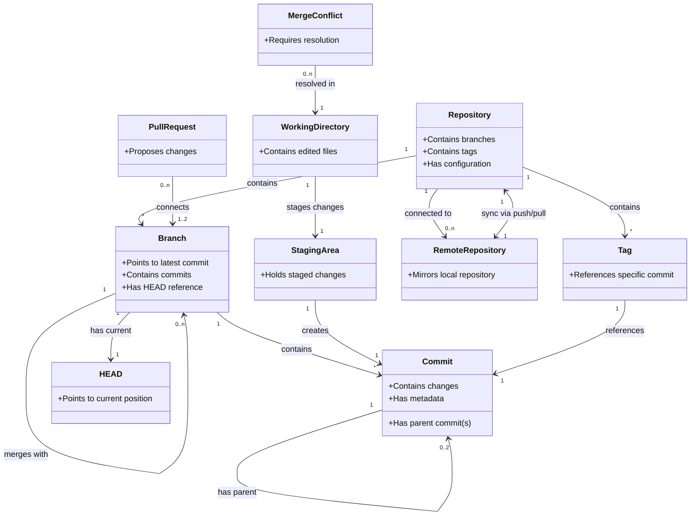

# Git Diagram

```mermaid
classDiagram
    class Repository {
        +Contains branches
        +Contains tags
        +Has configuration
    }
    class Branch {
        +Points to latest commit
        +Contains commits
        +Has HEAD reference
    }
    class Commit {
        +Has parent commit(s)
        +Contains changes
        +Has metadata
    }
    class WorkingDirectory {
        +Contains edited files
    }
    class StagingArea {
        +Holds staged changes
    }
    class RemoteRepository {
        +Mirrors local repository
    }
    class Tag {
        +References specific commit
    }
    class HEAD {
        +Points to current position
    }
    class MergeConflict {
        +Requires resolution
    }
    class PullRequest {
        +Proposes changes
    }

    Repository "1" --> "*" Branch : contains
    Repository "1" --> "*" Tag : contains
    Repository "1" --> "0..n" RemoteRepository : connected to
    Branch "1" --> "1" HEAD : has current
    Branch "1" --> "*" Commit : contains
    Branch "1" --> "0..n" Branch : merges with
    Commit "1" --> "0..2" Commit : has parent
    WorkingDirectory "1" --> "1" StagingArea : stages changes
    StagingArea "1" --> "1" Commit : creates
    RemoteRepository "1" <--> "1" Repository : sync via push/pull
    Tag "1" --> "1" Commit : references
    MergeConflict "0..n" --> "1" WorkingDirectory : resolved in
    PullRequest "0..n" --> "1..2" Branch : connects
```

