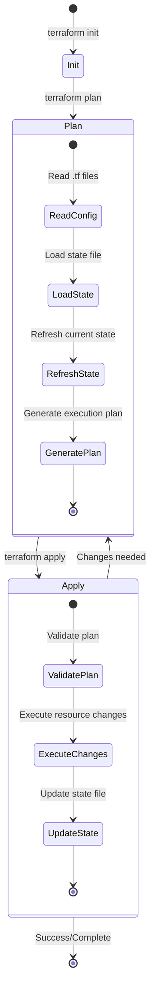
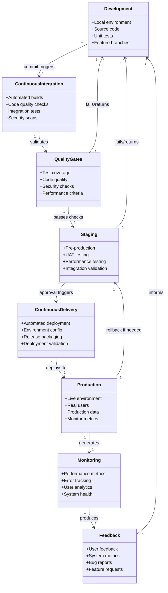
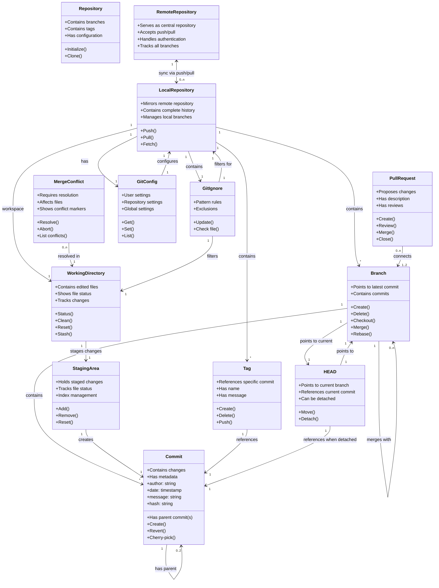
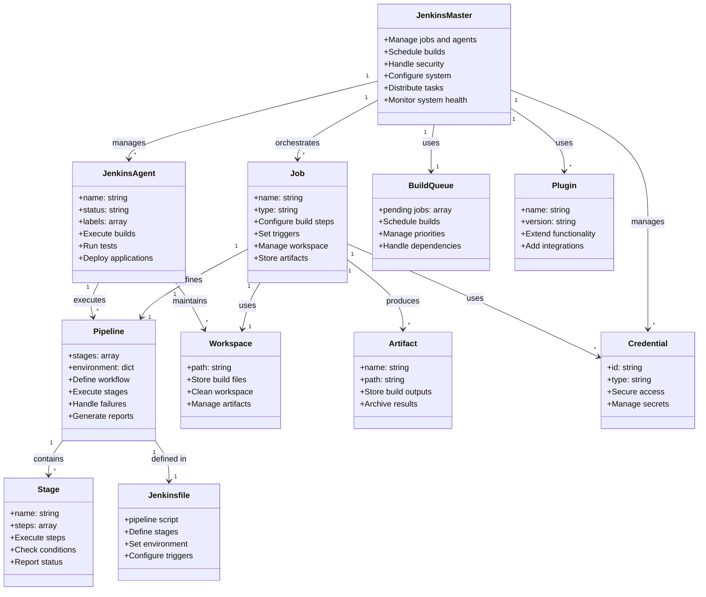
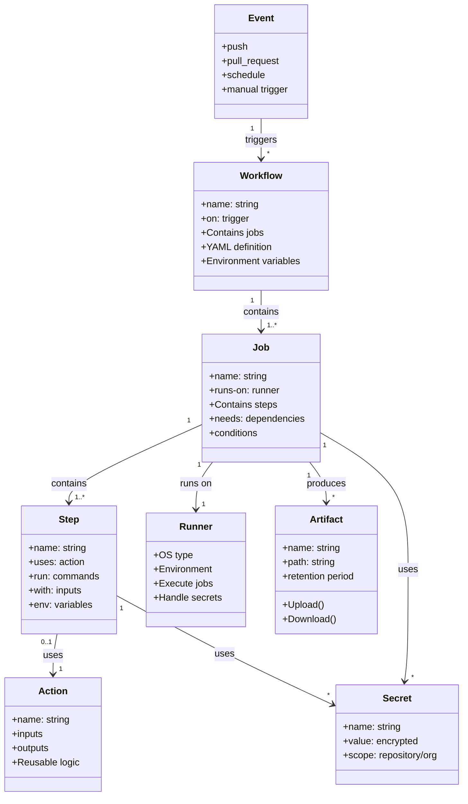
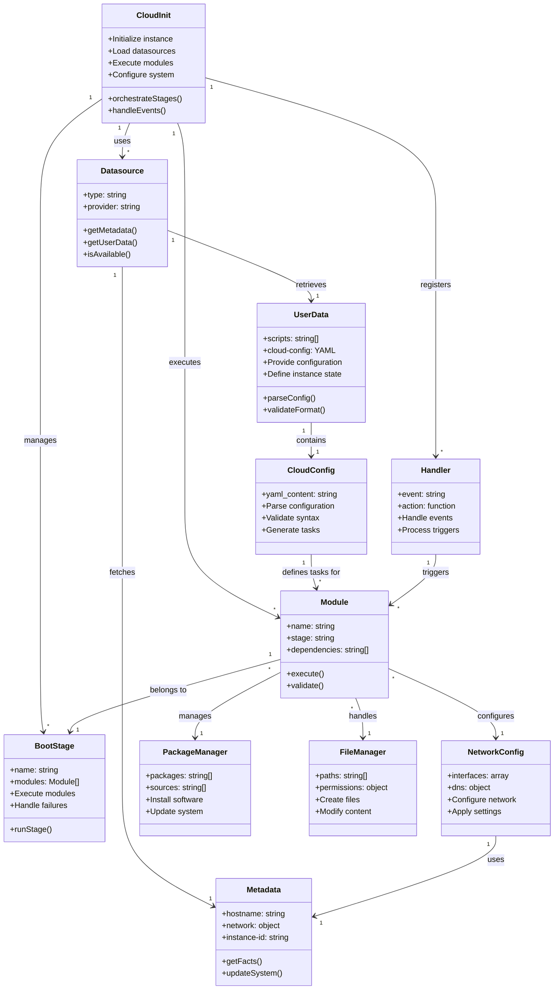
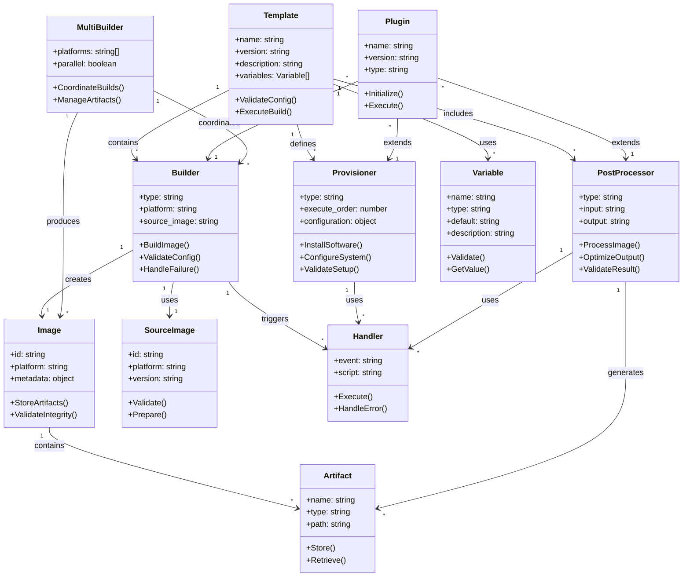

# CI/CD





# Git Diagram



# Jenkins


```yaml
// Jenkinsfile

pipeline {
    agent any

    environment {
        // Define environment variables or credentials
        DEPLOY_ENV = credentials('deploy-env-credential-id')
    }

    stages {
        stage('Build') {
            steps {
                echo 'Building the application...'
                sh 'npm install'
                sh 'npm run build'
            }
            post {
                success {
                    archiveArtifacts artifacts: 'dist/**/*', fingerprint: true
                }
            }
        }

        stage('Test') {
            steps {
                echo 'Running tests...'
                sh 'npm test'
            }
            post {
                always {
                    junit 'reports/**/*.xml'
                }
            }
        }

        stage('Deploy') {
            when {
                branch 'main'
            }
            steps {
                echo "Deploying to ${env.DEPLOY_ENV} environment..."
                sh './deploy.sh --env ${env.DEPLOY_ENV}'
            }
        }
    }

    post {
        failure {
            mail to: 'team@example.com',
                 subject: "Jenkins Pipeline Failed: ${currentBuild.fullDisplayName}",
                 body: "Something is wrong with ${env.JOB_NAME}.\nPlease check the Jenkins console output for details."
        }
    }
}
```
# GitHub Action


# Cloud-Init



# Packer


