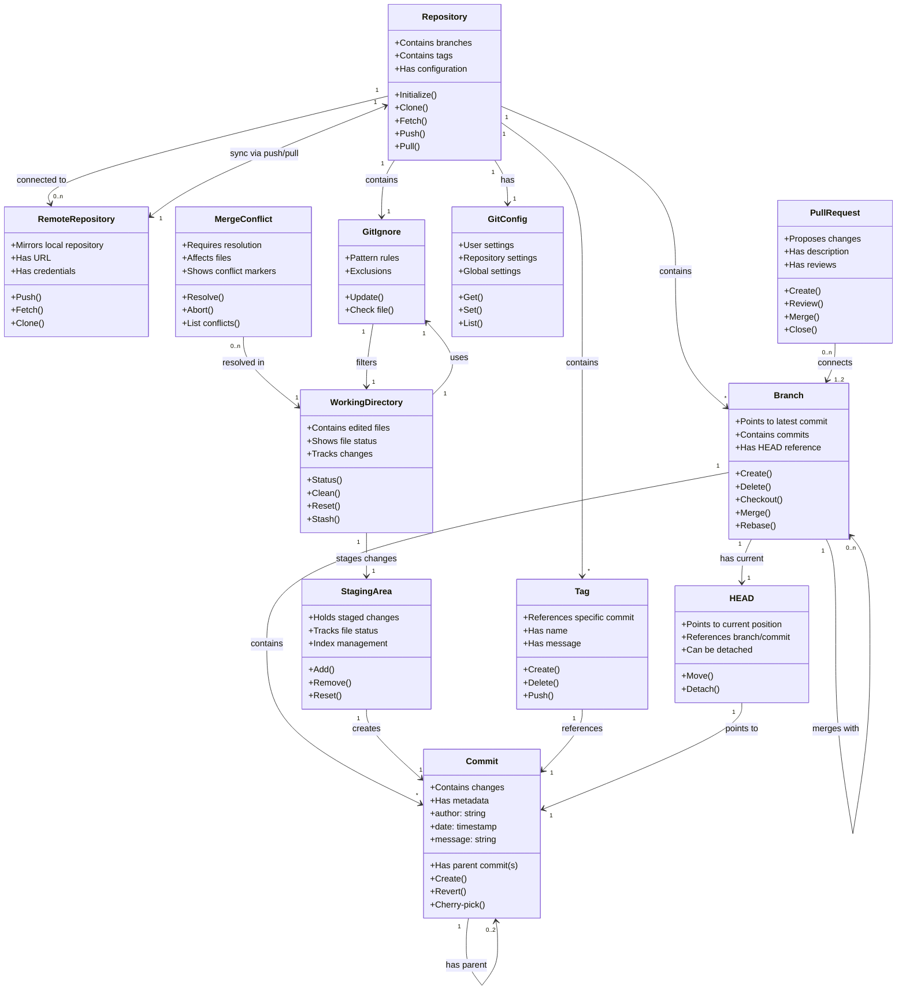

# Git Diagram

```mermaid
classDiagram
    class Repository {
        +Contains branches
        +Contains tags
        +Has configuration
        +Initialize()
        +Clone()
        +Fetch()
        +Push()
        +Pull()
    }
    class Branch {
        +Points to latest commit
        +Contains commits
        +Has HEAD reference
        +Create()
        +Delete()
        +Checkout()
        +Merge()
        +Rebase()
    }
    class Commit {
        +Has parent commit(s)
        +Contains changes
        +Has metadata
        +author: string
        +date: timestamp
        +message: string
        +Create()
        +Revert()
        +Cherry-pick()
    }
    class WorkingDirectory {
        +Contains edited files
        +Shows file status
        +Tracks changes
        +Status()
        +Clean()
        +Reset()
        +Stash()
    }
    class StagingArea {
        +Holds staged changes
        +Tracks file status
        +Index management
        +Add()
        +Remove()
        +Reset()
    }
    class RemoteRepository {
        +Mirrors local repository
        +Has URL
        +Has credentials
        +Push()
        +Fetch()
        +Clone()
    }
    class Tag {
        +References specific commit
        +Has name
        +Has message
        +Create()
        +Delete()
        +Push()
    }
    class HEAD {
        +Points to current position
        +References branch/commit
        +Can be detached
        +Move()
        +Detach()
    }
    class MergeConflict {
        +Requires resolution
        +Affects files
        +Shows conflict markers
        +Resolve()
        +Abort()
        +List conflicts()
    }
    class PullRequest {
        +Proposes changes
        +Has description
        +Has reviews
        +Create()
        +Review()
        +Merge()
        +Close()
    }
    class GitConfig {
        +User settings
        +Repository settings
        +Global settings
        +Get()
        +Set()
        +List()
    }
    class GitIgnore {
        +Pattern rules
        +Exclusions
        +Update()
        +Check file()
    }

    Repository "1" --> "*" Branch : contains
    Repository "1" --> "*" Tag : contains
    Repository "1" --> "0..n" RemoteRepository : connected to
    Repository "1" --> "1" GitConfig : has
    Repository "1" --> "1" GitIgnore : contains
    Branch "1" --> "1" HEAD : has current
    Branch "1" --> "*" Commit : contains
    Branch "1" --> "0..n" Branch : merges with
    Commit "1" --> "0..2" Commit : has parent
    WorkingDirectory "1" --> "1" StagingArea : stages changes
    StagingArea "1" --> "1" Commit : creates
    RemoteRepository "1" <--> "1" Repository : sync via push/pull
    Tag "1" --> "1" Commit : references
    MergeConflict "0..n" --> "1" WorkingDirectory : resolved in
    PullRequest "0..n" --> "1..2" Branch : connects
    GitIgnore "1" --> "1" WorkingDirectory : filters
    HEAD "1" --> "1" Commit : points to
    WorkingDirectory "1" --> "1" GitIgnore : uses
```

