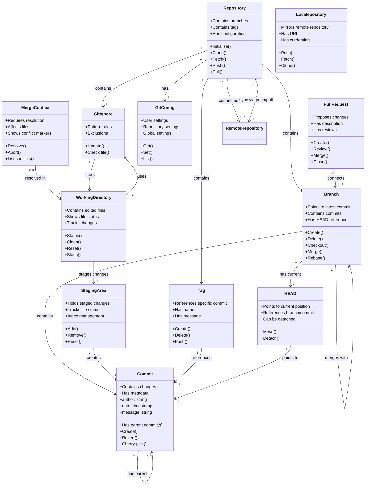

# Git Diagram



```mermaid
@startuml
' Define classes
class JenkinsMaster {
  - name: String
  - version: String
  + manageJobs()
  + scheduleJobs()
  + distributeTasks()
}

class JenkinsAgent {
  - name: String
  - OS: String
  - labels: String[]
  + executeJob()
  + reportStatus()
}

class Executor {
  - id: String
  - status: String
  + runStep()
  + updateStatus()
}

class Job {
  - name: String
  - type: String
  - status: String
  + defineWorkflow()
  + maintainBuildHistory()
}

class Pipeline {
  - script: String
  - stages: Stage[]
  + automateProcess()
  + visualizeWorkflow()
}

class Stage {
  - name: String
  - steps: Step[]
  + organizeTasks()
  + manageDependencies()
}

class Step {
  - name: String
  - command: String
  + executeAction()
}

class Jenkinsfile {
  - path: String
  + definePipeline()
}

class Plugin {
  - name: String
  - version: String
  + extendFunctionality()
  + integrateTools()
}

class BuildQueue {
  - queue_id: String
  - job: Job
  + enqueueJob()
  + dequeueJob()
}

class Artifact {
  - name: String
  - path: String
  + archive()
  + retrieve()
}

class Credential {
  - id: String
  - type: String
  + store()
  + retrieve()
}

' Define relationships
JenkinsMaster "1" --> "*" JenkinsAgent : manages >
JenkinsAgent "1" --> "*" Executor : runs >
Executor "1" --> "1" Step : executes >
Job "1" --> "1" Pipeline : defines >
Pipeline "1" --> "*" Stage : contains >
Stage "1" --> "*" Step : includes >
JenkinsMaster "1" --> "*" Job : schedules >
JenkinsMaster "1" --> "*" BuildQueue : manages >
BuildQueue "1" --> "1" Job : queues >
Job "1" --> "*" Artifact : produces >
Job "1" --> "*" Credential : uses >
Pipeline "1" --> "1" Jenkinsfile : defined by >
JenkinsMaster "1" --> "*" Plugin : utilizes >
Plugin "1" --> "*" JenkinsAgent : extends >
JenkinsMaster "1" --> "*" Credential : manages >
@enduml
```
