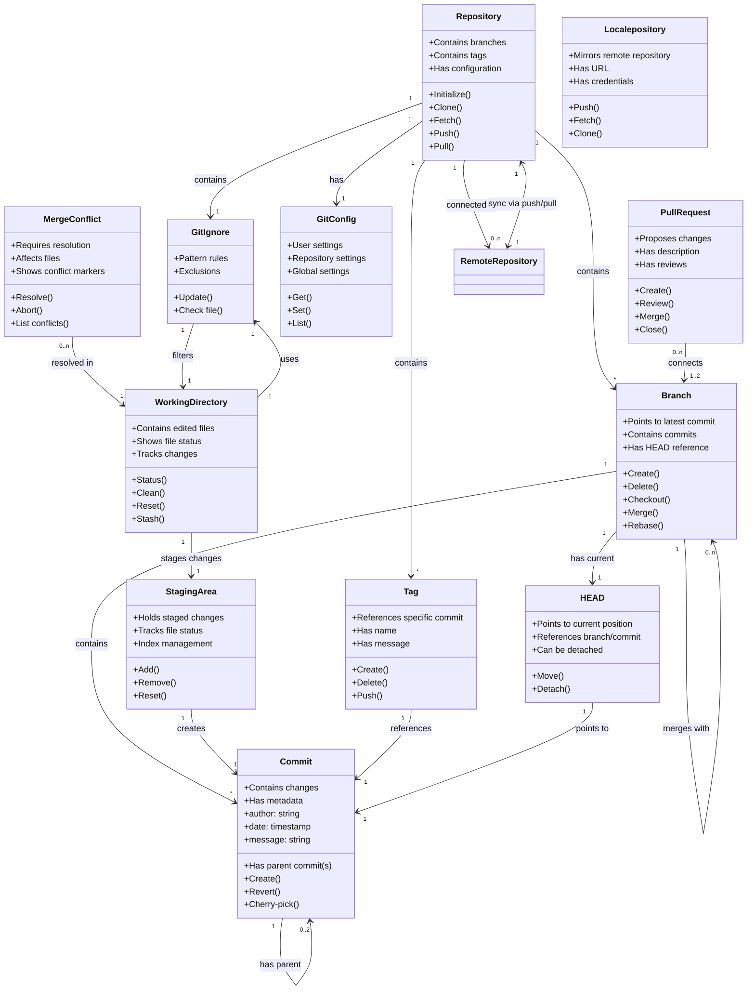
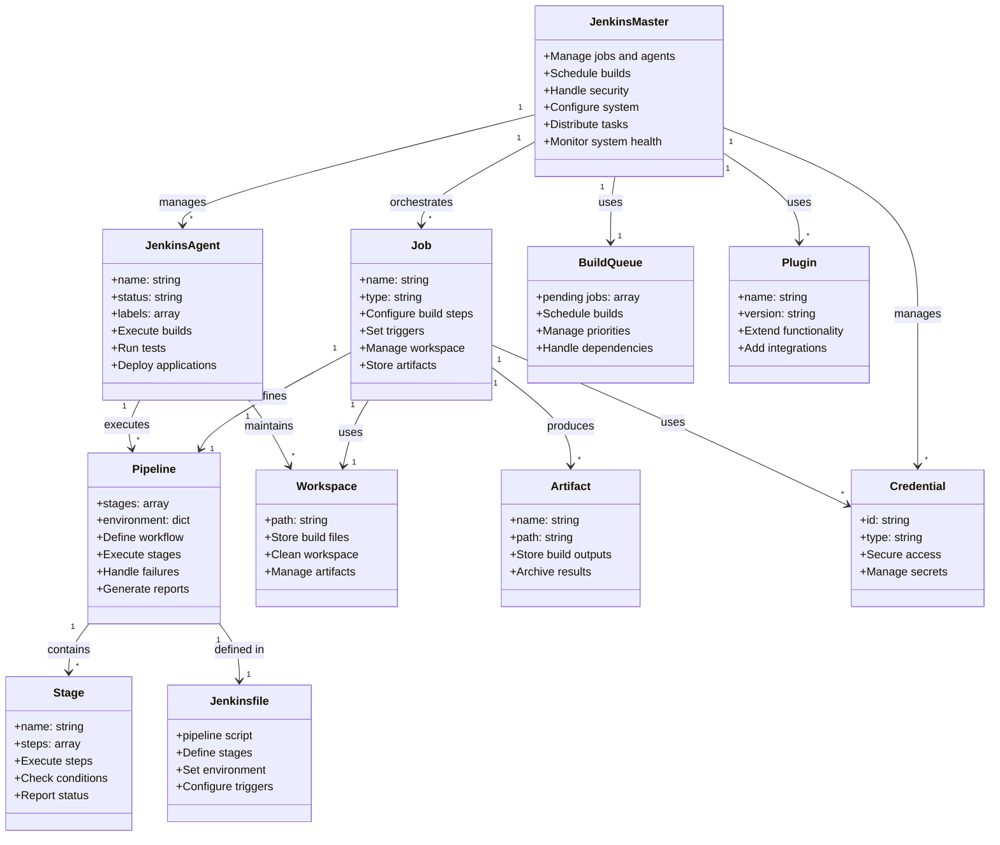

# Git Diagram

```mermaid
classDiagram
    class Repository {
        +Contains branches
        +Contains tags
        +Has configuration
        +Initialize()
        +Clone()
        +Fetch()
        +Push()
        +Pull()
    }
    class Branch {
        +Points to latest commit
        +Contains commits
        +Has HEAD reference
        +Create()
        +Delete()
        +Checkout()
        +Merge()
        +Rebase()
    }
    class Commit {
        +Has parent commit(s)
        +Contains changes
        +Has metadata
        +author: string
        +date: timestamp
        +message: string
        +Create()
        +Revert()
        +Cherry-pick()
    }
    class WorkingDirectory {
        +Contains edited files
        +Shows file status
        +Tracks changes
        +Status()
        +Clean()
        +Reset()
        +Stash()
    }
    class StagingArea {
        +Holds staged changes
        +Tracks file status
        +Index management
        +Add()
        +Remove()
        +Reset()
    }
    class Localepository {
        +Mirrors remote repository
        +Has URL
        +Has credentials
        +Push()
        +Fetch()
        +Clone()
    }
    class Tag {
        +References specific commit
        +Has name
        +Has message
        +Create()
        +Delete()
        +Push()
    }
    class HEAD {
        +Points to current position
        +References branch/commit
        +Can be detached
        +Move()
        +Detach()
    }
    class MergeConflict {
        +Requires resolution
        +Affects files
        +Shows conflict markers
        +Resolve()
        +Abort()
        +List conflicts()
    }
    class PullRequest {
        +Proposes changes
        +Has description
        +Has reviews
        +Create()
        +Review()
        +Merge()
        +Close()
    }
    class GitConfig {
        +User settings
        +Repository settings
        +Global settings
        +Get()
        +Set()
        +List()
    }
    class GitIgnore {
        +Pattern rules
        +Exclusions
        +Update()
        +Check file()
    }

    Repository "1" --> "*" Branch : contains
    Repository "1" --> "*" Tag : contains
    Repository "1" --> "0..n" RemoteRepository : connected to
    Repository "1" --> "1" GitConfig : has
    Repository "1" --> "1" GitIgnore : contains
    Branch "1" --> "1" HEAD : has current
    Branch "1" --> "*" Commit : contains
    Branch "1" --> "0..n" Branch : merges with
    Commit "1" --> "0..2" Commit : has parent
    WorkingDirectory "1" --> "1" StagingArea : stages changes
    StagingArea "1" --> "1" Commit : creates
    RemoteRepository "1" <--> "1" Repository : sync via push/pull
    Tag "1" --> "1" Commit : references
    MergeConflict "0..n" --> "1" WorkingDirectory : resolved in
    PullRequest "0..n" --> "1..2" Branch : connects
    GitIgnore "1" --> "1" WorkingDirectory : filters
    HEAD "1" --> "1" Commit : points to
    WorkingDirectory "1" --> "1" GitIgnore : uses
```

# Jenkis

```mermaid

classDiagram
    class JenkinsMaster {
        +Manage jobs and agents
        +Schedule builds
        +Handle security
        +Configure system
        +Distribute tasks
        +Monitor system health
    }
    class JenkinsAgent {
        +name: string
        +status: string
        +labels: array
        +Execute builds
        +Run tests
        +Deploy applications
    }
    class Pipeline {
        +stages: array
        +environment: dict
        +Define workflow
        +Execute stages
        +Handle failures
        +Generate reports
    }
    class Stage {
        +name: string
        +steps: array
        +Execute steps
        +Check conditions
        +Report status
    }
    class Job {
        +name: string
        +type: string
        +Configure build steps
        +Set triggers
        +Manage workspace
        +Store artifacts
    }
    class BuildQueue {
        +pending jobs: array
        +Schedule builds
        +Manage priorities
        +Handle dependencies
    }
    class Workspace {
        +path: string
        +Store build files
        +Clean workspace
        +Manage artifacts
    }
    class Jenkinsfile {
        +pipeline script
        +Define stages
        +Set environment
        +Configure triggers
    }
    class Plugin {
        +name: string
        +version: string
        +Extend functionality
        +Add integrations
    }
    class Artifact {
        +name: string
        +path: string
        +Store build outputs
        +Archive results
    }
    class Credential {
        +id: string
        +type: string
        +Secure access
        +Manage secrets
    }

    %% Core Relationships
    JenkinsMaster "1" --> "*" JenkinsAgent : manages
    JenkinsMaster "1" --> "*" Job : orchestrates
    JenkinsMaster "1" --> "1" BuildQueue : uses
    
    %% Job and Pipeline Relations
    Job "1" --> "1" Pipeline : defines
    Job "1" --> "1" Workspace : uses
    Job "1" --> "*" Artifact : produces
    
    %% Pipeline Structure
    Pipeline "1" --> "*" Stage : contains
    Pipeline "1" --> "1" Jenkinsfile : defined in
    
    %% Agent Relations
    JenkinsAgent "1" --> "*" Workspace : maintains
    JenkinsAgent "1" --> "*" Pipeline : executes
    
    %% Security and Extensions
    JenkinsMaster "1" --> "*" Credential : manages
    JenkinsMaster "1" --> "*" Plugin : uses
    Job "1" --> "*" Credential : uses
```
